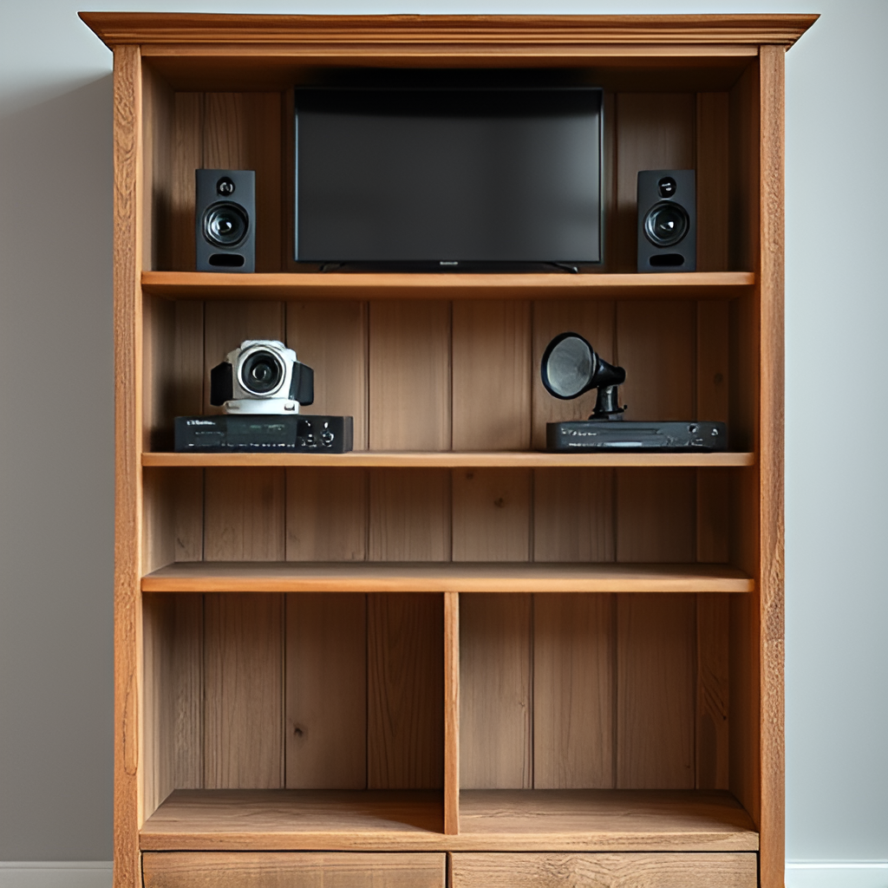

# AI-powered-waste-sorting-station
This is a concept for inexpensie and compact AI-powered waste sorting station, that helps people to sort waste, using recycled e-waste parts

---

# Why?
[Just a bit of stats](./why.md)

---

# Algorithm of actions:
[Can be found here](./algorithm.md)

---

# Components:
[Can be found here](./components.md)

---

# Some examples of waste
[Can be found here](./waste%20examples.md)

---

# AI-generated possible images of station

