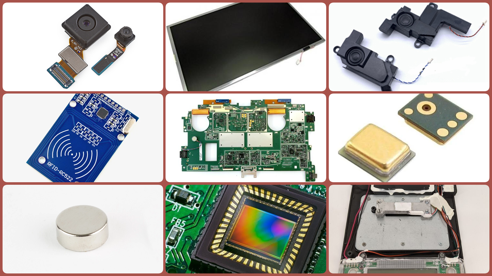

## Components

---

### **1. Camera (with AI Image Recognition)**
- **Source**: Cameras can be salvaged from **old smartphones, tablets, laptops**, or even **webcams**.
  - **Smartphones/Tablets**: The front or back cameras from older models can be repurposed.
  - **Webcams**: Common in older laptops and desktop computers, and can be found in second-hand electronics stores or recycling centers.
  - **Where to find**: E-waste recycling centers, second-hand shops, or your own discarded devices.

---

### **2. Optical Sensors (for Light/Color Detection)**
- **Source**: These can be salvaged from **printers**, **scanners**, or **barcode readers**.
  - **Printers/Scanners**: Both devices often have optical sensors used to detect paper presence or scan documents.
  - **Barcode Readers**: Old retail barcode scanners can provide optical sensors that detect reflected light or color.
  - **Where to find**: Discarded office equipment, e-waste centers, or second-hand office supply stores.

---

### **3. Weight Sensors**
- **Source**: Weight sensors can be salvaged from **digital kitchen scales**, **bathroom scales**, or **old postal scales**.
  - **Digital Scales**: The load cells inside these devices measure weight and can be repurposed for a sorting system.
  - **Where to find**: Old household items, online marketplaces for second-hand goods, or recycling centers.

---

### **4. Magnetic Sensors**
- **Source**: Magnetic sensors can be obtained from **hard drives**, **speakers**, or **metal detectors**.
  - **Hard Drives**: Old hard drives contain **neodymium magnets** that can detect ferrous metals (iron and steel).
  - **Speakers**: Speakers have magnets that can be used to sense ferrous metals.
  - **Metal Detectors**: Some industrial equipment or metal detectors contain advanced magnetic detection systems.
  - **Where to find**: E-waste centers, second-hand electronics stores, or discarded home electronics.

---

### **5. RFID/NFC Sensors**
- **Source**: RFID and NFC sensors can be salvaged from **old smartphones**, **access control systems**, or **RFID tag readers**.
  - **Smartphones**: Many modern smartphones have built-in NFC sensors that can be repurposed for reading RFID tags.
  - **Access Control Systems**: Old building security systems or keycard readers often have RFID sensors.
  - **Where to find**: E-waste centers, discarded smartphones, or second-hand electronic stores.

---

### **6. Microphones**
- **Source**: Microphones can be salvaged from **smartphones**, **laptops**, **headsets**, or **voice recorders**.
  - **Smartphones/Tablets**: The built-in microphones in these devices can be repurposed for voice recognition or communication in your sorting machine.
  - **Laptops**: Many laptops have integrated microphones for video calls that can be reused.
  - **Headsets/Voice Recorders**: Wired headsets or old voice recorders often have functional microphones.
  - **Where to find**: Discarded smartphones, laptops, or headsets from e-waste recycling centers or second-hand electronics stores.

---

### **7. Speakers**
- **Source**: Speakers can be salvaged from **laptops**, **televisions**, **old radios**, or **headsets**.
  - **Laptops/Desktops**: Most older laptops and desktops have built-in speakers that can be reused for audio output.
  - **Televisions and Radios**: Discarded TVs or radios often have small speakers that can be extracted and repurposed.
  - **Where to find**: E-waste centers, second-hand electronics stores, or from old laptops, TVs, or radios.

---

### **8. Display**
- **Source**: Displays can be repurposed from **laptops**, **tablets**, **televisions**, or **old monitors**.
  - **Laptops/Tablets**: The screens from old laptops and tablets can be reused for displaying sorting instructions or eco-points.
  - **Televisions/Monitors**: Larger displays can be sourced from discarded monitors or older TVs, though space might be a consideration in a smaller machine.
  - **Where to find**: E-waste centers, second-hand electronics stores, or through discarded laptops, tablets, or TVs.

---

### **9. Computer/Motherboard**
- **Source**: The processing unit (computer/motherboard) can be sourced from **old desktops**, **laptops**, **single-board computers (like Raspberry Pi)**, **tablets** or **smartphones**.
  - **Old Desktops/Laptops**: The motherboard or processor unit from an old desktop or laptop can be salvaged to control the sorting machine's sensors and interface.
  - **Tablets/smartphones**: The motherboard can be salvaged to control the sorting machine's sensors and interface.
  - **Raspberry Pi or Similar**: If available, a **single-board computer** like Raspberry Pi could also be used, especially for lightweight computing tasks.
  - **Where to find**: E-waste centers, second-hand stores, or old discarded computers or laptops.

---

### **Summary of Where to Obtain Sensors and Components**:
- **Old Smartphones/Tablets**: Cameras, RFID/NFC sensors, microphones.
- **Laptops/Desktops**: Cameras, microphones, speakers, displays, motherboards/processors.
- **Printers/Scanners**: Optical sensors, displays.
- **Digital Scales**: Weight sensors.
- **Hard Drives/Speakers**: Magnetic sensors (from hard drives), speakers.
- **Metal Detectors/Industrial Equipment**: Magnetic sensors.
- **Headsets/Voice Recorders**: Microphones, speakers.
- **Televisions/Monitors**: Displays, speakers.
- **Single-Board Computers (Raspberry Pi)**: Can be used as the main computer/motherboard for control.
- **E-Waste Centers and Recycling**: Best source for most components, especially for cameras, displays, motherboards, and electronics like laptops, printers, and scanners.
- **Second-Hand Stores**: Scales, old electronics, household items like printers, speakers, and monitors.

---