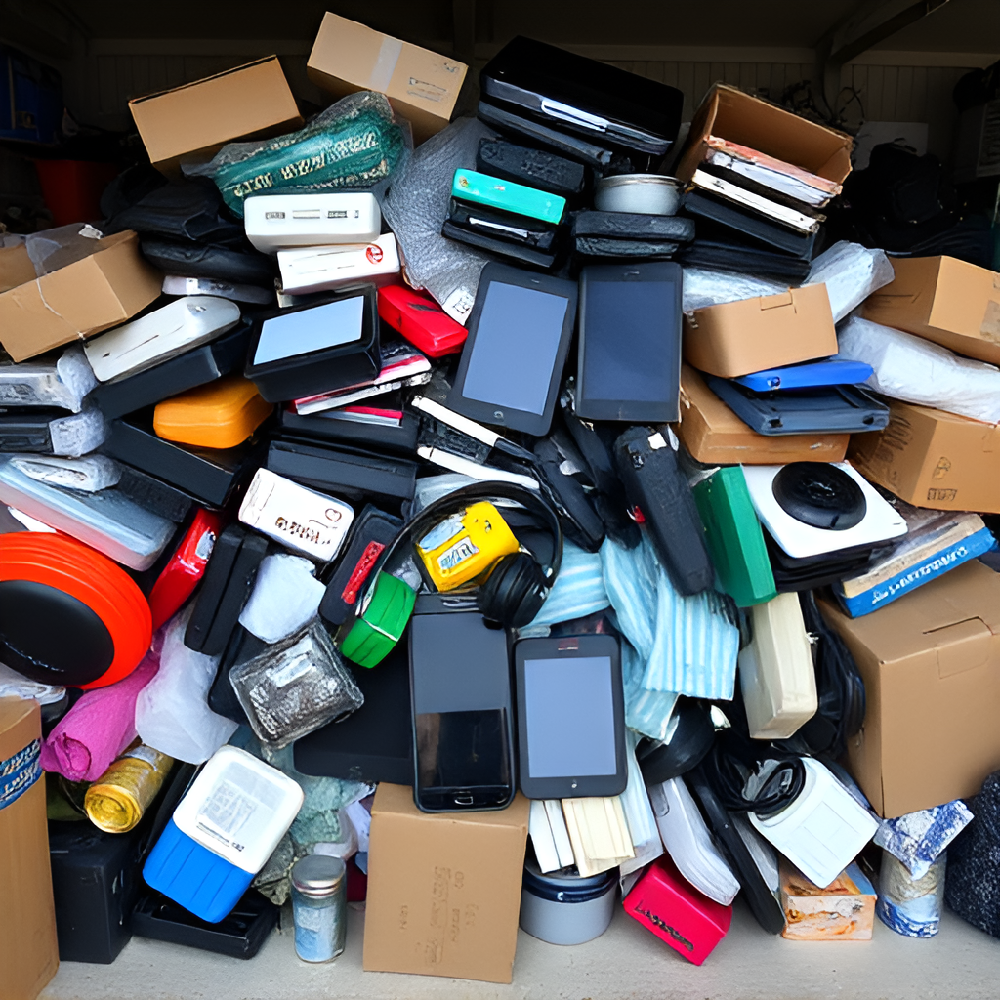
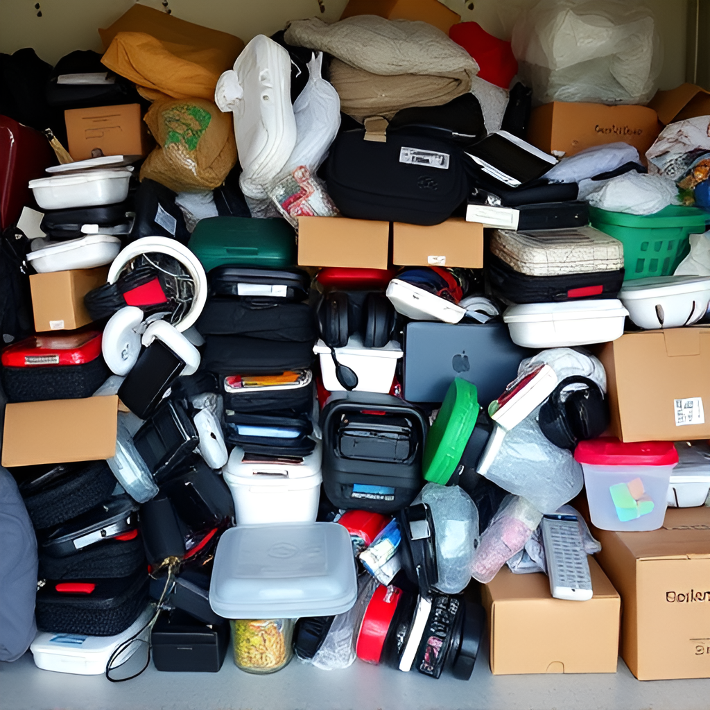

## Waste examples

### **1. Small Electronics (E-Waste)**
- **Examples**: Phones, chargers, headphones, small remote controls, tablets.
- **Why**: Small electronics are frequently disposed of, often still functional or repairable. They contain valuable materials (metals, plastics) and are easier to sort than larger appliances.
- **Machine’s Role**: It can identify whether the item is functional, broken, or valuable for parts and suggest either repair (second-hand market) or recycling (e-waste).

### **2. Plastics**
- **Examples**: Food containers, plastic bags, packaging.
- **Why**: Plastics are common in households, and different types of plastics can be sorted for recycling. The machine could focus on easy-to-recycle plastics like PET (#1) and HDPE (#2), guiding users to dispose of harder-to-recycle plastics elsewhere.
- **Machine’s Role**: Recognizes plastic types via optical sensors or code detection, separates clean/dirty plastics, and directs them into recycling.

### **3. Metal Items**
- **Examples**: Small cookware, metal cutlery.
- **Why**: Metals, especially aluminum, are highly recyclable and valuable in recycling markets. Small metal objects are easy to sort without needing heavy equipment.
- **Machine’s Role**: Detects ferrous and non-ferrous metals (steel vs. aluminum) and guides users to place them in the correct bin. Items in good condition could be sent for second-hand use (e.g., utensils).

### **4. Textiles**
- **Examples**: Clothing, shoes, bags.
- **Why**: Textiles are often thrown out but can be sold second-hand or repurposed. A portion of disposed textiles is still in good condition, suitable for donation or resale.
- **Machine’s Role**: Assesses condition (stained, torn, wearable) and recommends either second-hand (good condition) or recycling (damaged textiles).

### **5. Glass**
- **Examples**: Jars.
- **Why**: Glass is 100% recyclable but often improperly sorted. Small glass items can easily be collected in neighborhood settings for recycling or reuse.
- **Machine’s Role**: Distinguishes between different glass colors and cleanliness and guides the user to place clean, intact glass in recycling bins.

### **6. Cardboard and Paper**
- **Examples**: Cardboard boxes, office paper, newspapers, magazines.
- **Why**: Paper and cardboard are common household waste items, easily recyclable if sorted properly. Clean and undamaged cardboard can be reused, while the rest can be recycled.
- **Machine’s Role**: Identifies condition (clean vs. contaminated) and directs users to recycle or reuse. It could guide users to flatten cardboard for easy handling.

---

### **Waste Categories for the Machine**:

1. **E-Waste** (for repair, parts, or recycling).
2. **Plastics** (recycling, especially PET/HDPE).
3. **Metals** (aluminum vs. steel for recycling).
4. **Textiles** (second-hand shops, repair, or recycling).
5. **Glass** (recycling or reuse).
6. **Cardboard/Paper** (recycling or reuse).

---